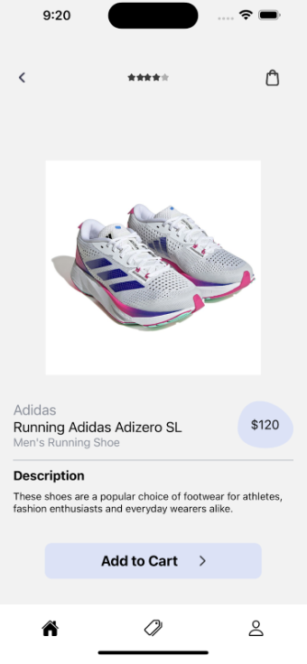

# Sneak-er : a react-native mobile app for sneakers
### CO8SFDM0 Mobile development course at University (2022)
=======================

<p align="center">
     
</p>

### Description:
Sneak-er is a simple React-Native with some features :)

### Installation:
To set up the project on your local machine, follow these simple steps:

```bash
# Core components and common dependencies
npm install @react-navigation/native
npx expo install react-native-screens react-native-safe-area-context

# StackNavigator is used
npm install @react-navigation/native-stack

# BottomTabNavigator is used
npm install @react-navigation/bottom-tabs

# Redux is used
npm install @reduxjs/toolkit
```

### Run the project :
To run the project, follow this step: 

```bash
npm start
```

